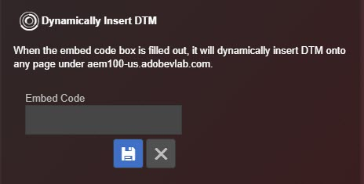

# 도구{#tools}

도구 화면에서 설치된 솔루션에 대한 다양한 도구를 활성화하거나 비활성화할 수 있습니다. 예를 들어 Target의 콘솔 디버깅 문을 켜거나 DTM 스테이징 라이브러리를 사용할 수 있습니다. 이러한 도구는 Target 및 DTM이 페이지에 설치된 경우에만 사용할 수 있습니다.

어떤 페이지에서든 Adobe Experience Platform Launch 또는 DTM을 동적으로 삽입하여 플랫폼 론치 또는 DTM이 설치되지 않은 페이지에서 어떤 것을 테스트할 수 있습니다. **[!UICONTROL Embed Code]** 아이콘을 클릭한 다음 [포함 코드](https://docs.adobe.com/content/help/ko-KR/dtm/using/client-side/deployment.html)를 입력하고 **[!UICONTROL Save]**&#x200B;를 클릭합니다.

## DTM 정보 {#section-c3d43040440449e5a050170843a600b7}

<table id="table_04625C3319134E169A35DB74C1D1FB31"> 
 <thead> 
  <tr> 
   <th colname="col1" class="entry"> 도구 </th> 
   <th colname="col2" class="entry"> 설명 </th> 
  </tr>
 </thead>
 <tbody> 
  <tr> 
   <td colname="col1"> 
 DTM 콘솔 로깅 
 </td> 
   <td colname="col2"> 
이 도구는 DTM 특정 디버깅 문을 브라우저 콘솔에 표시합니다. 
 </td> 
  </tr> 
  <tr> 
   <td colname="col1"> 
스테이징 라이브러리 사용 
 </td> 
   <td colname="col2"> 
이 도구는 DTM 디버깅 정보에 스테이징 라이브러리를 사용합니다. 
 </td> 
  </tr> 
  <tr> 
   <td colname="col1"> 
DTM 비활성화 
 </td> 
   <td colname="col2"> 
이 도구는 DTM 정보를 확인하지 못하도록 합니다. 
 </td> 
  </tr> 
  <tr> 
   <td colname="col1"> 
 동적으로 DTM 삽입 
 </td> 
   <td colname="col2"> 
 이 도구는 페이지에 DTM 코드를 삽입합니다. 포함 코드 편집기를 사용하여 삽입된 코드를 편집합니다. 
 </td> 
  </tr> 
 </tbody> 
</table>

## Target 정보 {#section-31090d95f50e455692b672c26e6a2051}

<table id="table_A71D269B49F4417599EBACA44D5CCF4F"> 
 <thead> 
  <tr> 
   <th colname="col1" class="entry"> 도구 </th> 
   <th colname="col2" class="entry"> 설명 </th> 
  </tr>
 </thead>
 <tbody> 
  <tr> 
   <td colname="col1"> 
Target 콘솔 로깅 
 </td> 
   <td colname="col2"> 
이 도구는  mboxDebug=true라는 쿠키를 브라우저에 추가하여 Target 특정 디버깅 문을  AT: 접두사로 시작하는 브라우저 콘솔에 표시합니다. 현재 이 콘솔 문은 디버거 로그 화면에 표시되지 않고 브라우저의 기본 디버깅 콘솔에 표시됩니다. 
 
 이 도구를 사용하려면 at.js 0.9.6+가 필요합니다. at.js의 이전 버전을 사용하는 경우 콘솔 로깅을 켜기 위해  ?mboxDebug=true 쿼리 문자열 매개 변수를 URL에 추가할 수 있습니다. mbox.js를 사용하는 경우  ?_AT_Debug=console 매개 변수를 추가하여 Visual Experience Composer 활동으로 제한된 콘솔 로깅을 켤 수 있습니다. 
 </td> 
  </tr> 
  <tr> 
   <td colname="col1"> 
 Mbox 추적 활성화 
 </td> 
   <td colname="col2"> 
이 도구는 디버거의  Target&gt;Mbox 추적 화면에서 탐색할 수 있는 Target 응답에 세부 정보를 추가합니다. 
 
 이 도구를 활성화하려면 Chrome 탭 중 하나에서 Experience Cloud에 로그인되어 있어야 합니다. 
 </td> 
  </tr> 
  <tr> 
   <td colname="col1"> 
Target 비활성화 
 </td> 
   <td colname="col2"> 
이 도구는  mboxDisable=true 라는 쿠키를 브라우저에 추가하여 모든 Target 요청을 비활성화합니다. 
 
 이 도구를 사용하려면 at.js 0.9.6+가 필요합니다. 이전 버전을 사용 중인 경우 URL에  ?mboxDisable=true  쿼리 문자열 매개 변수를 추가하여 mbox를 비활성화할 수 있습니다. 
 </td> 
  </tr> 
  <tr> 
   <td colname="col1"> 
 Mbox 강조 표시 
 </td> 
   <td colname="col2"> 
 이 도구는 기존 자동 줄바꿈 스타일의 mbox 주위에 빨간색 상자를 그립니다. 
 </td> 
  </tr> 
 </tbody> 
</table>

다음 비디오는 Adobe Target에서 디버거 확장을 사용하는 방법을 설명합니다.

>[!VIDEO](https://video.tv.adobe.com/v/23115t2/)
